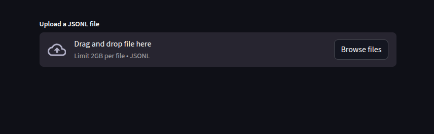
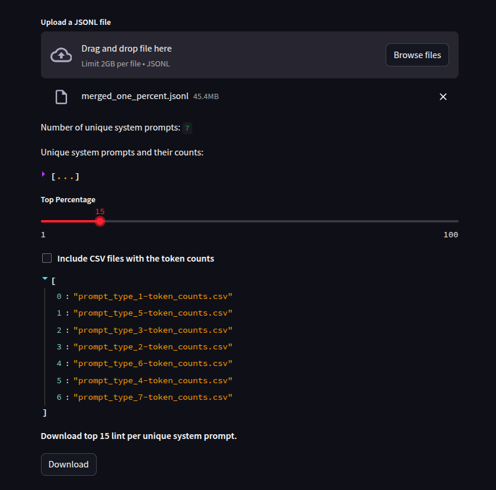

# TOP 10% LINT
This scripts calculates and extracts the top percentile lint per system prompt type in a dataset. It identifies each unique sys_prompt and extract each to corresponding `jsonl` files.  
To calculate the top performing prompts, `TikToken` was used.

## RUN
To run the code, first install the required libraries.  
- Create a new local environment (`.venv`) or install to global python interpreter.
```python3
pip install -r requirement.txt
```
- Inorder to increase the file upload limit, in a global **config file** at `~/.streamlit/config.toml` for **macOS/Linux** or `%userprofile%/.streamlit/config.toml` for **Windows**, add:
```python
[server]
maxUploadSize = 2000
```
- Next, start `streamlit`
```python
streamlit run system_prompt_analyzer.py
```


## Usage
open http://192.168.0.123:851 and upload a file
  
Note that, you can increase file limit by changing the value of `maxUploadSize` in the toml file.  

Select the the percentage to extract, with or without the `csv` files containig the token counts.
  

When finished extracting, click `download` to download the `zip` file.